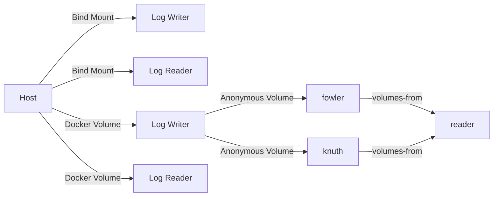

# 🐳 Docker Log Sharing: Multi-Container Data Management

[](https://github.com/TheToriqul/docker-log-sharing)
[](https://github.com/TheToriqul/docker-log-sharing/stargazers)
[](https://www.docker.com/)
[](https://www.alpinelinux.org/)
[](https://www.gnu.org/software/bash/)

## 📋 Project Overview

The Docker Log Sharing project is a comprehensive demonstration of advanced Docker concepts, focusing on efficient methods for sharing log files between multiple containers. It explores two primary approaches: bind mounts and Docker volumes, highlighting the advantages of using Docker volumes for improved portability, simplified management, and enhanced security.

As part of my learning journey, I developed this project to gain hands-on experience with container orchestration, data persistence, and optimizing multi-container setups. By delving into various log sharing techniques, I have acquired valuable insights into designing scalable and maintainable Docker architectures.

### 🎯 Core Purpose

- Showcase the benefits of using Docker volumes over bind mounts for log sharing
- Demonstrate the flexibility and ease of use provided by anonymous volumes and the `--volumes-from` flag
- Provide a practical example of managing and sharing data between containers

### 👥 Target Audience

- Developers interested in advanced Docker concepts and best practices
- DevOps engineers looking to optimize multi-container setups
- Anyone curious about container data persistence and sharing strategies

### 💼 Business/Technical Value

- Enhances understanding of Docker volumes and their advantages over bind mounts
- Demonstrates techniques for efficient data sharing between containers
- Provides a foundation for designing scalable and maintainable container architectures
- Offers insights into optimizing disk space usage and managing container volumes

### 🚀 Current Status

The project is complete and fully functional, serving as a comprehensive learning resource and reference implementation. It can be easily adapted and extended to fit various use cases and requirements.

## 🏗 Technical Architecture



### 📚 Tech Stack Overview

- Containerization: 
- Base Image: 
- Scripting: 

### 🌐 Data Flow

1. Log files are generated by the log-writing containers
2. Logs are stored on the host or in Docker volumes
3. Log-reading containers access the logs via bind mounts or volume mounts
4. Anonymous volumes are created and shared between containers using the `--volumes-from` flag

### 🔗 Key Integrations

- Docker Engine API for container and volume management
- Bind mounts for host-container file sharing
- Docker volumes for portable and manageable data persistence

### 🚀 Deployment Architecture

The project is designed for local development and testing. However, it can be easily adapted for production deployments using container orchestration platforms like Kubernetes or Docker Swarm.

## ⭐ Features & Functionality

1. 📂 Bind Mount Sharing
   - Set up a known directory on the host for log storage
   - Create log-writing and log-reading containers using bind mounts
   - View logs directly from the host

2. 💾 Docker Volume Sharing
   - Create a named Docker volume for log persistence
   - Create log-writing and log-reading containers using the Docker volume
   - Access logs from the host using the volume's mount point

3. 🔒 Anonymous Volumes and `--volumes-from` Flag
   - Create containers with anonymous volumes for flexible data sharing
   - Share volumes between containers using the `--volumes-from` flag
   - Inspect the volumes of containers to understand the sharing mechanism

4. 🧹 Volume Management
   - List and remove specific volumes
   - Prune unused volumes to optimize disk space
   - Forcefully remove all volumes when necessary

<details>
<summary>📖 Comprehensive Feature List</summary>

1. User-friendly setup and configuration
2. Seamless log sharing between containers
3. Support for both bind mounts and Docker volumes
4. Utilization of anonymous volumes for dynamic data sharing
5. Flexibility to share volumes between multiple containers
6. Direct access to logs from the host for easy monitoring
7. Efficient volume management and cleanup operations
8. Detailed documentation and reference commands

</details>

## 👨‍💻 Technical Implementation

### 🖥️ Frontend

- N/A

### 🖥️ Backend

- Docker containerization for encapsulating log-writing and log-reading processes
- Bind mounts for host-container log sharing
- Named Docker volumes for portable and manageable log persistence
- Anonymous volumes for flexible data sharing between containers

### 🚀 DevOps

- Dockerfile for building custom container images
- Shell scripting for automating container and volume management tasks
- Integration with container orchestration platforms for production deployments

## 🎓 Learning Journey

### 🔧 Technical Mastery

1. Advanced understanding of Docker volumes and their advantages over bind mounts
2. Proficiency in designing and implementing multi-container data sharing strategies
3. Expertise in leveraging anonymous volumes and the `--volumes-from` flag for flexible container communication
4. Mastery of Docker volume management, cleanup, and optimization techniques
5. In-depth knowledge of Dockerfile best practices and container image building

### 💼 Professional Growth

1. Enhanced problem-solving skills through tackling complex container orchestration challenges
2. Improved ability to design scalable and maintainable container architectures
3. Strengthened communication and documentation skills by creating comprehensive project READMEs and reference guides
4. Expanded knowledge of DevOps best practices and container lifecycle management
5. Cultivated a continuous learning mindset and the ability to quickly adapt to new technologies and practices

## 🔮 Future Enhancements

<details>
<summary>View Planned Improvements</summary>

1. Implement log rotation and archival for better log management
2. Explore distributed logging solutions for scalability and fault tolerance
3. Integrate with a centralized logging platform for aggregation and analysis
4. Develop a web-based log viewer for easy access and monitoring
5. Enhance security by implementing encrypted volumes and access controls
6. Automate setup and deployment using Docker Compose and container orchestration tools

</details>

## ⚙️ Setup Guide

<details>
<summary>View Setup Instructions</summary>

### Prerequisites

- Docker 20.10.17 or higher
- Alpine Linux 3.16 or compatible
- Basic understanding of Docker concepts and command-line interface

### Installation

1. Clone the repository:
   ```
   git clone https://github.com/TheToriqul/docker-log-sharing.git
   ```

2. Navigate to the project directory:
   ```
   cd docker-log-sharing
   ```

3. Build the custom Docker image:
   ```
   docker build -t my_writer .
   ```

### Configuration

No additional configuration is required. The necessary commands and instructions are provided in the [reference commands guide](reference-commands.md).

</details>

## 📝 Documentation

- [Reference Commands Guide](reference-commands.md)
- [Dockerfile](Dockerfile)
- [Docker Documentation](https://docs.docker.com/)

## 🤝 Contributing Guidelines

Thank you for your interest in contributing to the Docker Log Sharing project! If you'd like to contribute, please follow these steps:

1. Fork the repository to your GitHub account.
2. Create a new branch for your changes.
3. Make your modifications and ensure that the project still functions as expected.
4. Write clear, concise, and meaningful Git commit messages.
5. Push your changes to your forked repository.
6. Submit a pull request to the main repository with a detailed description of your changes.

If you have any questions, issues, or ideas for improvements, please don't hesitate to open an issue in the repository or reach out to me directly.

## 📜 Licensing

The Docker Log Sharing project is open-source and released under the [MIT License](LICENSE). You are free to use, modify, and distribute the code for personal or commercial purposes.

## 📞 Contact Information

- 📧 Email: toriqul.int@gmail.com
- 📱 Phone: +65 8936 7705, +8801765 939006
- 🌐 LinkedIn: [https://www.linkedin.com/in/thetoriqul/](https://www.linkedin.com/in/thetoriqul/)
- 🐙 GitHub: [https://github.com/TheToriqul](https://github.com/TheToriqul)
- 🌍 Portfolio: [https://thetoriqul.com](https://thetoriqul.com)

## 💡 Additional Resources

- [Docker Volumes Documentation](https://docs.docker.com/storage/volumes/)
- [Bind Mounts vs Volumes](https://docs.docker.com/storage/bind-mounts/)
- [Docker Best Practices](https://docs.docker.com/develop/dev-best-practices/)
- [Dockerfile Reference](https://docs.docker.com/engine/reference/builder/)

## 🙏 Acknowledgments

- [Poridhi](https://poridhi.io/) for providing an excellent learning environment and hands-on labs
- The Docker community for their invaluable resources and support
- My mentor Mr. Shajal Ahmed and colleagues for their guidance and encouragement throughout my learning journey

---
I hope that this project serves as a valuable learning resource and a testament to my growing skills in Docker and container orchestration. Feel free to explore the codebase, experiment with different configurations, and adapt it to suit your needs. 

Thank you for taking the time to check out my Docker Log Sharing project. If you have any questions, feedback, or opportunities to collaborate, please don't hesitate to reach out. Happy containerizing! 😄🐳